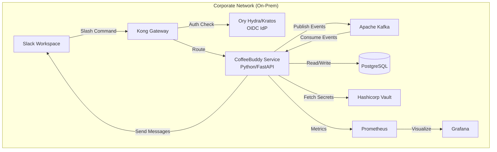
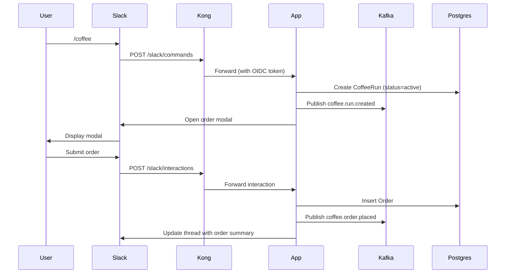
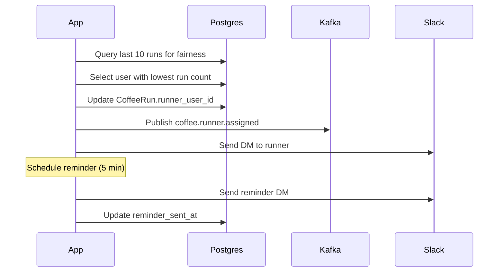
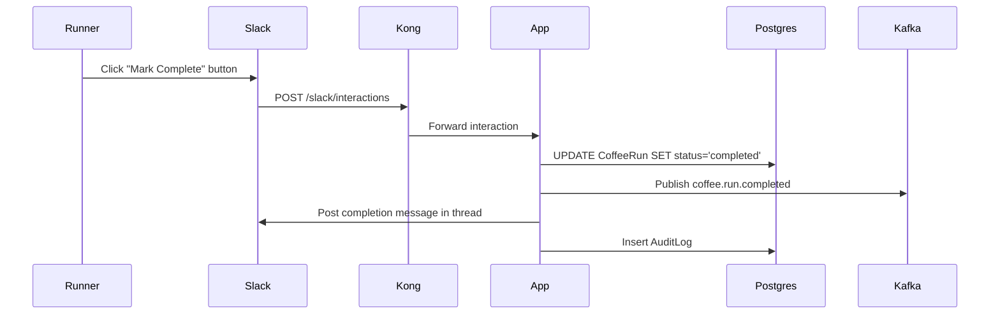

# SPEC — CoffeeBuddy (On-Prem)

## Summary
CoffeeBuddy is an on-premises Slack application that coordinates office coffee runs within a corporate network. Users submit orders via Slack slash commands, the system fairly assigns a runner, sends reminders, and persists preferences—all without external cloud dependencies. The solution runs on Kubernetes with enterprise-grade identity (Ory Hydra/Kratos), API gateway (Kong), and event streaming (Kafka).

## Goals
- Enable teammates to submit coffee orders via Slack in under 30 seconds.
- Automatically assign a fair runner based on rotation history.
- Send timely reminders to runners and participants.
- Persist user preferences (drink type, size, customizations) for future runs.
- Operate entirely on-prem with no external cloud service dependencies.
- Integrate with enterprise OIDC identity provider for authentication.

## Non-Goals
- Payment processing or financial transactions.
- Integration with external coffee vendor APIs or delivery services.
- Mobile native applications outside Slack.
- Real-time location tracking of runners.
- Multi-tenant SaaS deployment.

## Users & Context
**Primary Users:**
- Office teammates who place coffee orders (10–50 users per workspace).
- Designated runner who picks up orders for the group.

**Secondary Users:**
- Office managers monitoring fairness and coordination efficiency.

**Context:**
- Enterprise Slack workspace with restricted internet access.
- On-premises Kubernetes cluster (3+ nodes).
- Internal identity provider (Ory Hydra/Kratos) with OIDC.
- Kong Gateway for internal API routing.
- Kafka for event buffering and resilience.
- PostgreSQL for persistent storage.
- Hashicorp Vault for secrets management.

## Functional Requirements
- Accept `/coffee` slash command in Slack to initiate a coffee run.
- Allow users to submit orders with drink type, size, and customizations.
- Display current run summary with all orders in a Slack thread.
- Assign a runner using round-robin or weighted fairness algorithm.
- Send Slack DM reminder to runner 5 minutes after assignment.
- Allow runner to mark run as complete via Slack button.
- Store user preferences (last 3 orders) and suggest on next run.
- Provide `/coffee-history` command to view past 10 runs.
- Support `/coffee-cancel` to abort a run before pickup.
- Log all events (order placed, runner assigned, run completed) for audit.

## Non-Functional Requirements
- **Availability:** 99.5% uptime during business hours (8am–6pm local time).
- **Latency:** Slack command response within 2 seconds; order confirmation within 5 seconds.
- **Scalability:** Support up to 50 concurrent users per workspace; 100 orders per day.
- **Security:** All API calls authenticated via OIDC; secrets stored in Vault; no plaintext credentials.
- **Compliance:** Data residency within corporate network; audit logs retained for 90 days.
- **Resilience:** Kafka buffering tolerates Slack API rate limits (50 req/min); automatic retry with exponential backoff.
- **Observability:** Prometheus metrics for command latency, order volume, runner assignment; Grafana dashboards for ops team.

## High-Level Architecture



**Components:**
- **Kong Gateway:** Internal API gateway; validates OIDC tokens; routes `/slack/*` to CoffeeBuddy service.
- **CoffeeBuddy Service:** Python FastAPI application; handles Slack commands, business logic, runner assignment.
- **Kafka:** Event stream for Slack events, order submissions, runner assignments; buffers during rate limits.
- **PostgreSQL:** Persistent storage for orders, runs, user preferences, audit logs.
- **Ory Hydra/Kratos:** OIDC identity provider; issues tokens for service-to-service auth.
- **Hashicorp Vault:** Secrets manager for Slack signing secret, database credentials, API tokens.
- **Prometheus/Grafana:** Metrics collection and visualization.

## Interfaces

### Slack Commands
- **`/coffee`**: Initiate a new coffee run; opens modal for order submission.
- **`/coffee-history`**: Display last 10 runs with timestamps and participants.
- **`/coffee-cancel`**: Cancel active run (only by initiator or runner).

### Slack Events (via Events API)
- **`app_mention`**: Respond to `@CoffeeBuddy help` with usage instructions.
- **`message.channels`**: Listen for order edits in run threads (optional).

### REST API (Internal)
- **POST `/api/v1/runs`**: Create new coffee run (called by Slack command handler).
- **POST `/api/v1/runs/{run_id}/orders`**: Add order to run.
- **PATCH `/api/v1/runs/{run_id}/complete`**: Mark run as complete.
- **GET `/api/v1/users/{user_id}/preferences`**: Retrieve user's last 3 orders.
- **GET `/api/v1/runs/{run_id}`**: Fetch run details and orders.

### Kafka Topics
- **`slack.events`**: Incoming Slack events (commands, interactions).
- **`coffee.orders`**: Order submission events.
- **`coffee.assignments`**: Runner assignment events.
- **`coffee.completions`**: Run completion events.

## Data Model (logical)

### Entity: User
- `user_id`: VARCHAR(64) — Slack user ID (PK)
- `display_name`: VARCHAR(255) — Slack display name
- `email`: VARCHAR(255) — Corporate email (from OIDC)
- `created_at`: TIMESTAMP — Account creation time
- `updated_at`: TIMESTAMP — Last activity time

### Entity: CoffeeRun
- `run_id`: UUID — Primary key
- `workspace_id`: VARCHAR(64) — Slack workspace ID
- `channel_id`: VARCHAR(64) — Slack channel where run initiated
- `initiator_user_id`: VARCHAR(64) — FK to User
- `runner_user_id`: VARCHAR(64) — FK to User (assigned)
- `status`: ENUM('active', 'completed', 'cancelled') — Run state
- `created_at`: TIMESTAMP — Run start time
- `completed_at`: TIMESTAMP — Run completion time (nullable)
- `reminder_sent_at`: TIMESTAMP — Reminder timestamp (nullable)

### Entity: Order
- `order_id`: UUID — Primary key
- `run_id`: UUID — FK to CoffeeRun
- `user_id`: VARCHAR(64) — FK to User
- `drink_type`: VARCHAR(100) — e.g., "Latte", "Espresso"
- `size`: VARCHAR(20) — e.g., "Small", "Medium", "Large"
- `customizations`: TEXT — JSON array of customizations
- `created_at`: TIMESTAMP — Order submission time

### Entity: UserPreference
- `preference_id`: UUID — Primary key
- `user_id`: VARCHAR(64) — FK to User
- `drink_type`: VARCHAR(100)
- `size`: VARCHAR(20)
- `customizations`: TEXT — JSON array
- `order_count`: INT — Number of times ordered
- `last_ordered_at`: TIMESTAMP — Most recent order time

### Entity: AuditLog
- `log_id`: UUID — Primary key
- `event_type`: VARCHAR(50) — e.g., "order_placed", "run_completed"
- `user_id`: VARCHAR(64) — FK to User (nullable)
- `run_id`: UUID — FK to CoffeeRun (nullable)
- `payload`: JSONB — Event details
- `timestamp`: TIMESTAMP — Event time

## Key Workflows

### Workflow: Initiate Coffee Run


### Workflow: Assign Runner


### Workflow: Complete Run


## Security & Compliance
- **Authentication:** All API requests authenticated via OIDC tokens issued by Ory Hydra; Kong validates tokens before routing.
- **Authorization:** Users can only view/edit their own orders; runners can complete assigned runs; admins can cancel any run.
- **Secrets Management:** Slack signing secret, database credentials, and API tokens stored in Hashicorp Vault; rotated every 90 days.
- **Data Encryption:** TLS 1.3 for all internal service-to-service communication; PostgreSQL connections encrypted with SSL.
- **Audit Logging:** All order placements, runner assignments, and completions logged to `AuditLog` table; retained for 90 days.
- **Data Residency:** All data stored on-prem; no external API calls except to internal Slack workspace.
- **Rate Limiting:** Kong enforces 100 req/min per user; Kafka buffers events during Slack API rate limits (50 req/min).

## Deployment & Operations
- **Platform:** Kubernetes 1.28+ with 3 worker nodes (4 vCPU, 16 GB RAM each).
- **Deployment:** Helm chart for CoffeeBuddy service; 3 replicas for high availability.
- **CI/CD:** Jenkins pipeline for build, test, and deploy; automated rollback on health check failure.
- **Configuration:** Environment-specific ConfigMaps for Slack workspace ID, Kafka brokers, PostgreSQL connection strings.
- **Secrets:** Vault integration via Kubernetes service account; secrets injected as environment variables.
- **Monitoring:** Prometheus scrapes `/metrics` endpoint; Grafana dashboards for command latency, order volume, error rates.
- **Logging:** Structured JSON logs to stdout; aggregated via Fluentd to internal log store.
- **Backup:** PostgreSQL daily backups to on-prem NAS; 30-day retention.
- **Disaster Recovery:** RTO 4 hours, RPO 24 hours; restore from latest backup and replay Kafka events.

## Risks & Mitigations
- **Risk:** Slack API rate limits (50 req/min) cause message delivery delays.
  - **Mitigation:** Kafka buffers events; exponential backoff with jitter; batch message sends where possible.
- **Risk:** Unfair runner assignment if users join/leave team frequently.
  - **Mitigation:** Weighted fairness algorithm considers last 30 days of activity; exclude inactive users (no orders in 14 days).
- **Risk:** Database connection pool exhaustion under high load.
  - **Mitigation:** Connection pooling with max 20 connections; circuit breaker pattern; horizontal scaling of app replicas.
- **Risk:** Slack workspace downtime prevents order submission.
  - **Mitigation:** Graceful degradation; queue events in Kafka; retry when Slack recovers; notify users via fallback channel.
- **Risk:** Secrets leaked in logs or error messages.
  - **Mitigation:** Sanitize logs; never log tokens or credentials; Vault audit logs for secret access.

## Assumptions
- Slack Enterprise Grid is approved for internal use; incoming webhooks and slash commands are allowed.
- Corporate network allows outbound HTTPS to Slack API endpoints (api.slack.com) via internal proxy.
- Kubernetes cluster has persistent volume provisioner for PostgreSQL StatefulSet.
- Ory Hydra/Kratos is already deployed and configured for OIDC; service accounts can be created for CoffeeBuddy.
- Kafka cluster has at least 3 brokers with replication factor 2.
- Users have corporate email addresses in OIDC claims; used for audit logs.
- Office hours are 8am–6pm local time; no SLA outside business hours.
- Coffee runs are informal; no legal or financial liability for incorrect orders.

## Success Metrics
- **Weekly Active Runs:** At least 10 coffee runs per week per 20 active users.
- **Command Response Time:** 95th percentile latency under 2 seconds for `/coffee` command.
- **Order Confirmation Time:** 95th percentile time from first order to runner assignment under 5 minutes.
- **Fairness Score:** Standard deviation of run counts per user under 2 over 30-day window.
- **Error Rate:** Less than 1% of commands result in error responses.
- **User Satisfaction:** Post-run survey (optional) shows 80%+ satisfaction with coordination time.

## Acceptance Criteria
- **AC1:** When a user types `/coffee` in Slack, the system responds with an order modal within 2 seconds; modal includes fields for drink type, size, and customizations.
- **AC2:** When 3 users submit orders within 5 minutes, the system assigns a runner using round-robin fairness (user with fewest runs in last 30 days) and posts assignment message in thread within 10 seconds.
- **AC3:** When a runner is assigned, the system sends a Slack DM reminder within 5 minutes; reminder includes order summary and "Mark Complete" button.
- **AC4:** When a runner clicks "Mark Complete," the system updates run status to `completed` in PostgreSQL, publishes `coffee.run.completed` event to Kafka, and posts confirmation message in thread within 3 seconds.
- **AC5:** When a user types `/coffee-history`, the system retrieves last 10 runs from PostgreSQL and displays them in Slack within 2 seconds; each entry shows timestamp, runner, and order count.
- **AC6:** When Slack API returns HTTP 429 (rate limit), the system buffers events in Kafka, retries with exponential backoff (initial 1s, max 60s), and successfully delivers message within 5 minutes.
- **AC7:** When a user submits 3 orders over 7 days, the system stores preferences in `UserPreference` table and suggests last order (drink type, size) in next `/coffee` modal.
- **AC8:** When PostgreSQL connection fails, the system returns HTTP 503 to Kong, logs error to Prometheus, and recovers automatically when database is available (circuit breaker opens after 5 failures, half-open after 30s).

## Out Of Scope
- Payment processing, invoicing, or financial reconciliation with coffee vendors.
- Integration with external delivery services (Uber Eats, DoorDash).
- Mobile native applications outside Slack (iOS, Android).
- Real-time GPS tracking of runner location.
- Multi-tenant SaaS deployment for multiple organizations.
- Advanced analytics or machine learning for order prediction.
- Integration with calendar systems for automatic run scheduling.

## Note from Harper Orchestrator (Super User) to be applied
This SPEC is ready for `/plan` phase. Ensure PLAN includes:
- Detailed task breakdown for Slack command handlers, runner assignment algorithm, and Kafka event consumers.
- Explicit test cases for fairness algorithm (round-robin with weighted history).
- Deployment checklist for Kubernetes Helm chart, Vault secret injection, and Kong route configuration.
- Observability setup for Prometheus metrics (command latency, order volume, error rates) and Grafana dashboards.

```SPEC_END```